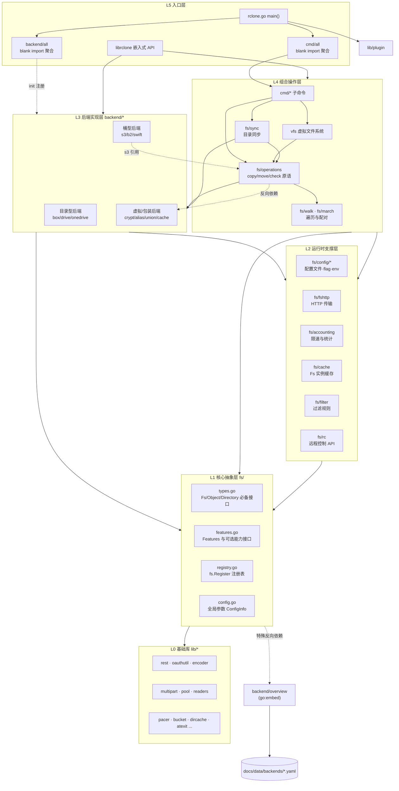

# rclone 架构与分层设计

本文档基于对 fork 仓库（`XyzenSun/rclone`，master @ `9e27583e8`，`VERSION=v1.76.0`）的源码探索整理，作为后续魔改（新增完整 backend、保持与原版可 merge）的架构参考。所有结论均来自源码验证，涉及的关键文件路径在文中直接给出，便于回溯。

## 1. 仓库现状与约束

fork 与上游 `rclone/rclone` 完全一致，无任何本地改动，也没有 tag。本 fork 的魔改目标决定了三条硬约束：只新增完整 backend（不改动现有 backend 的行为）；不修改任何参数默认值（默认值调整全部通过环境变量在部署侧完成）；配置文件与命令行行为与原版保持兼容，最终自行编译二进制。

与上游同步通过 GitHub 进行（fork 页面的 Sync fork 或 PR 方式），本地不维护 upstream remote。由于 fork 上没有 tag，同步后如需按版本定位，可从上游仓库 fetch tag。

## 2. 顶层目录结构

```
rclone/
├── backend/          70 个远程存储后端，每个提供商一个子目录
│   ├── all/all.go    空导入(blank import)聚合，编译期把所有 backend 注册进 fs.Registry
│   └── <name>/       单个后端：<name>.go + api/ + 测试 + 文档片段
├── cmd/              所有 CLI 子命令（sync/copy/mount/rc/serve...），cmd/all 同样聚合
├── fs/               核心抽象层：接口、特性、注册表、配置、操作原语
├── fstest/           集成测试框架（fstests、test_all、mockfs/mockobject）
├── lib/              通用基础库（rest/oauthutil/encoder/multipart/pool...）
├── vfs/              mount 用的虚拟文件系统层
├── librclone/        嵌入式 API（供 Go/Python/PHP 等嵌入调用）
├── docs/             文档站点；data/backends/*.yaml 是 backend 元数据（被 embed 进二进制）
├── bin/              构建与文档生成脚本（make_backend_docs.py、manage_backends.py 等）
└── rclone.go         主入口：blank import backend/all + cmd/all + lib/plugin
```

`rclone.go` 的 main 函数只有三行有效导入：backend/all、cmd/all、lib/plugin，随后调用 `cmd.Main()`。所有功能都通过 init 注册机制挂载，这是整个架构可插拔的基础。

## 3. 分层设计

整体自底向上分为五层。依赖方向在正常情况下严格单向：上层依赖下层，同层之间尽量不互相依赖。



各层职责如下。

L0 基础库 `lib/` 提供无业务语义的通用能力：`rest` 是对 net/http 的薄封装（新后端首选 HTTP 客户端），`oauthutil` 封装 OAuth 流程与 token 续期，`encoder` 处理路径字符编码（几乎每个后端都要配置），`multipart`/`pool`/`readers` 提供池化的上传缓冲（配合 `--max-buffer-memory`、`--use-mmap`），`pacer` 提供带退避的重试节流，`dircache` 缓存目录 ID 到路径的映射。lib 原则上不依赖 fs。

L1 核心抽象 `fs/` 是整个项目的契约中心。`fs/types.go` 定义必备接口：`Fs`（List/NewObject/Put/Mkdir/Rmdir）、`Info`（Name/Root/String/Precision/Hashes/Features）、`Object`（SetModTime/Open/Update/Remove）、`ObjectInfo`、`DirEntry`、`Directory`，以及一批可选接口（MimeTyper、IDer、Metadataer、SetTierer 等）。`fs/features.go` 定义 `Features` 结构：布尔位描述能力（CaseInsensitive、BucketBased、ReadMimeType 等），函数位描述可选操作（Purge/Copy/Move/DirMove/ListR/ListP/About/OpenChunkWriter/CleanUp/Command 等），上层据此决定走服务端复制还是回退到下载-上传。`fs/registry.go` 提供 `RegInfo` 与 `fs.Register()`，是所有 backend 的注册入口，`Option` 类型（含 Advanced/Sensitive/Examples/Hide/NoPrefix 等控制项）也定义在这里。`fs/config.go` 定义全局参数 `ConfigInfo`（--transfers、--checkers、--fast-list、--bwlimit、--buffer-size 等）以及 `NewFs`/`ParseRemote`。`fs/backend_config.go` 定义配置向导协议 `ConfigIn`/`ConfigOut`。

L2 运行时支撑包括 `fs/config/*`（configmap/configstruct 负责配置绑定，flags/configflags 负责命令行与环境变量映射）、`fs/fshttp`（统一 HTTP 传输，自动获得 --dump、--tpslimit、--user-agent 能力）、`fs/accounting`（带宽限制与传输统计）、`fs/cache`（Fs 实例缓存）、`fs/filter`（include/exclude 过滤）、`fs/rc`（rc API）。

L3 后端实现 `backend/*` 每个提供商一个包。包内标准结构是 `<name>.go`（init 注册 + Options struct + Fs + Object 实现）、`api/types.go`（API 数据类型）、`<name>_test.go`。官方规范明确禁止拆成 fs.go + object.go，并要求新后端严格模仿参考后端的代码顺序与命名，这是为了 70 个后端的可维护性。目录型后端参考 box（展示 dircache 用法），桶型后端参考 b2。

L4 组合操作 `fs/operations`（Copy/Move/Check/Delete 等原语）、`fs/sync`（目录同步）、`fs/walk`/`fs/march`（遍历与两侧目录配对）、`vfs`（mount 支撑）。这一层把 L1 的接口编排成高层语义，决定重试、多线程、server-side 加速策略。

L5 入口 `cmd/*`（每个子命令一个包）与 `librclone`。cmd 只做参数解析与对 L4 的调用。

## 4. 引用关系与两个必须注意的反向边

实测（go list）各层直接依赖如下：`fs` 依赖 backend/overview、fs/config/configmap、fs/config/configstruct、fs/fserrors、fs/fspath、fs/hash、lib/caller、lib/errcount、lib/pacer；`backend/local` 依赖 fs、fs/accounting、fs/config、fs/filter、fs/hash、lib/encoder、lib/file、lib/readers；`backend/s3` 额外依赖 fs/chunksize、fs/fshttp、fs/list、fs/operations、lib/bucket、lib/multipart、lib/pool、lib/rest、lib/transferaccounter 等；`fs/operations` 依赖 backend/crypt、fs/accounting、fs/march、fs/list、fs/walk、lib/multipart、lib/pool、lib/http 等；`fs/sync` 依赖 fs/operations、fs/march、lib/transform 等；`cmd` 依赖 fs/operations、fs/sync、fs/config 全家、fs/rc/rcserver 等。

两条反向/特殊依赖是魔改时最容易踩的坑，必须牢记。

第一条：L1 的 `fs` 包 import 了 `backend/overview`，后者通过 `go:embed` 读取 `docs/data/backends/*.yaml`。也就是说 `fs.Register()` 在注册时会查找 `docs/data/backends/<name>.yaml`，找不到时打印 `internal error: no overview data found`（Errorf 级别，不崩溃）。因此新增 backend 必须同步创建该 yaml，否则每次启动都有错误日志。

第二条：L4 的 `fs/operations` import 了 L3 的 `backend/crypt`（Copy 等操作需要感知 crypt 包装），`backend/s3` 也 import `fs/operations`。核心层与后端层存在少量双向依赖，这意味着改动 fs/operations 或 fs 核心的影响面极大，本 fork 的策略是完全不碰这些文件。

## 5. 后端注册与配置机制

后端包在 `init()` 中调用 `fs.Register(&fs.RegInfo{...})`，RegInfo 携带 Name、Description、NewFs 工厂函数、可选的 Config 向导函数、Options 列表、CommandHelp、Aliases 等。Register 会为 Options 补默认值、追加全局的 description 选项、加载 overview 元数据，并处理别名注册。注册完成后，`cmd/cmd.go:525` 处遍历 `fs.Registry`，对每个 backend 调用 `flags.AddFlagsFromOptions(pflag.CommandLine, fsInfo.Prefix, fsInfo.Options)`，把每个 option 变成命令行 flag（如 `--box-upload-cutoff`）。

环境变量机制（本 fork 替换默认值的官方途径，无需改任何代码）由 `fs/config/flags/flags.go` 的 `installFlag` 实现：每个 flag 安装时查找 `fs.OptionToEnv(flagName)`，即 `RCLONE_` 前缀 + flag 名大写 + 连字符转下划线。例如 `--transfers` 对应 `RCLONE_TRANSFERS`，`--box-upload-cutoff` 对应 `RCLONE_BOX_UPLOAD_CUTOFF`（对该类型所有 remote 生效的"默认值"级别覆盖）。针对具体 remote 实例的覆盖则走 `fs.ConfigEnv`（config.go:834），格式为 `RCLONE_CONFIG_<REMOTE>_<OPTION>`，例如 `RCLONE_CONFIG_MYREMOTE_TYPE=box`。installFlag 读到环境变量后会同时更新 flag 的 DefValue 并调用 `opt.MarkUnset()`，保证环境变量只是默认值级别，命令行与配置文件中更具体的设置仍然优先。这一优先级设计正好满足"环境变量替换默认值"的需求。

配置绑定的链路是：`fs.ConfigMap`（fs/configmap.go:115）聚合配置文件、命令行 flag、环境变量、连接字符串等来源，`fs/config/configstruct` 通过 struct 的 `config:"name"` tag 把值填进 backend 的 Options struct。NewFs 工厂函数收到 configmap.Mapper 后自行解析。

## 6. 新增完整 backend 的触点清单

以新增名为 `zen` 的 backend 为例，需要触碰的文件如下。前四项是代码与注册（新增目录 + 一行 import，冲突面极小），后五项是文档与测试元数据（多为追加一行，merge 时偶尔需要手动合入）。

| 文件 | 动作 | 说明 |
| --- | --- | --- |
| `backend/zen/zen.go` | 新增 | init + fs.Register + Options struct + Fs/Object 实现 |
| `backend/zen/api/types.go` | 新增 | API 数据类型定义 |
| `backend/zen/zen_test.go` | 新增 | 单元/集成测试，从 box 或 b2 复制改造 |
| `backend/all/all.go` | 追加一行 | `_ "github.com/rclone/rclone/backend/zen"`，按字母序插入 |
| `docs/data/backends/zen.yaml` | 新增 | overview 元数据，缺失会报 internal error |
| `docs/content/zen.md` | 新增 | 手写文档 + autogenerated options 注释块 |
| `README.md`、`docs/content/docs.md`、`docs/content/_index.md` | 各追加一行 | remote 列表，按字母序 |
| `fstest/test_all/config.yaml` | 追加一段 | 集成测试注册 |
| `docs/layouts/chrome/navbar.html`、`bin/make_manual.py` | 各追加一行 | 网站导航与手册目录（可选，纯文档） |

实现要点：HTTP 型后端优先使用 `lib/rest` + `fs/fshttp` 的 Client；路径编码用 `lib/encoder` 配置；上传缓冲从 `lib/multipart`/`lib/pool` 取；可选能力尽量多实现（ListR/ListP/Copy/Move/DirMove/About/Purge 等），每个实现的能力都要在 `Features` 里挂上对应函数位；`rclone test info` 命令可帮助确定编码需求。测试需要配置名为 `TestZen` 的 remote 后运行 `go test -v`，集成测试用 `go run ./fstest/test_all -backends zen`。

## 7. fork 维护与 upstream merge 策略

本 fork 的兼容性设计核心是"改动面最小化"：所有魔改集中在 `backend/zen/` 新目录（上游永远不会碰它，零冲突）；`backend/all/all.go` 只按字母序插一行（上游新增 backend 时可能相邻行冲突，git 通常能自动合并或手动秒解）；docs 与 fstest 的 yaml 均为追加条目，冲突概率低且解法机械。完全不修改 fs/、fs/operations、fs/config 及任何现有 backend 的代码，参数默认值调整交给环境变量（RCLONE_* / RCLONE_CONFIG_*），因此配置文件与命令行行为与原版二进制完全一致。

同步上游通过 GitHub 完成：fork 页面 Sync fork（或向上游发 PR 后再 sync），本地 `git pull origin master` 即可拿到合并结果。建议在 fork 上用长期分支（如 `zen`）积累魔改，master 保持与上游同步，需要时把 zen rebase 或 merge 到 master 上再编译发布，这样 Sync fork 按钮永远可用，不会被本地提交挡住。

编译二进制直接 `go build`（或 `make` 以获得更准确的版本信息），交叉编译用 `GOOS/GOARCH` 控制。
